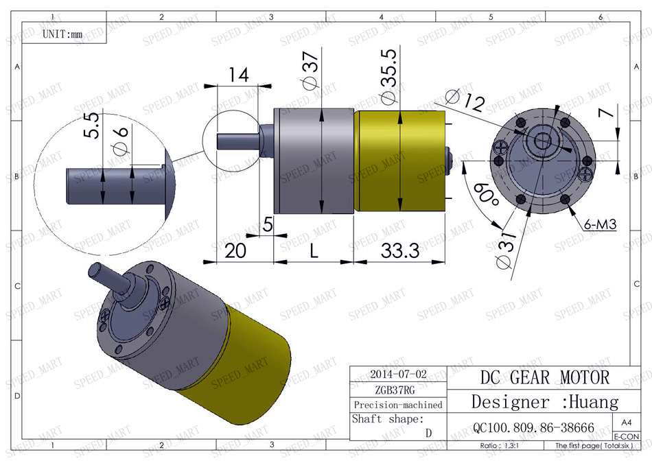
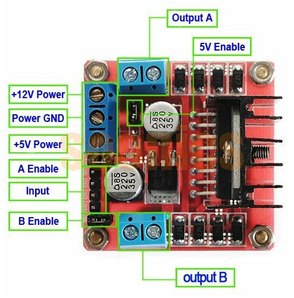
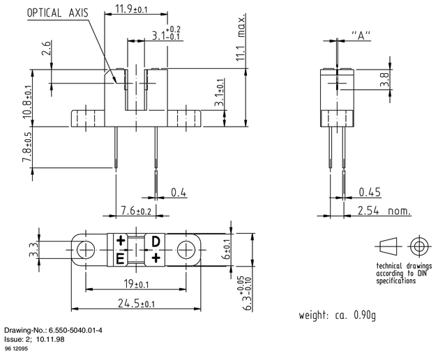

# w1 Mark I - Watch Winder

[Main page]

## Electronics

### Arduino
Technical specifications:
- Model: [Arduino Leonardo] 

#### Diagram
                                 .-----.                     
    .----[PWR]-------------------| USB |--.                  
    |                            '-----'  |                  
    |                                     |                  
    |                           A5/SCL[ ] |   C5             
    |                           A4/SDA[ ] |   C4             
    |                             AREF[ ] |                  
    |                              GND[ ] |                  
    | [ ]NC                     SCK/13[ ]~|   B5             
    | [ ]v.ref                 MISO/12[ ] |   .              
    | [ ]RST                   MOSI/11[ ]~|   .              
    | [ ]3V3   +-----+              10[ ]~|   .              
    | [ ]5v    |     |               9[ ]~|   .              
    | [ ]GND   | MCU |               8[ ] |   B0             
    | [ ]GND   |     |                    |                  
    | [ ]Vin   +-----+               7[ ] |   D7             
    |                                6[ ]~|   .              
    | [ ]A0                          5[ ]~|   .              
    | [ ]A1                          4[ ] |   .              
    | [ ]A2                     INT1/3[ ]~|   .              
    | [ ]A3                     INT0/2[ ] |   .              
    | [ ]A4/SDA  RST SCK MISO     TX>1[ ] |   .              
    | [ ]A5/SCL  [ ] [ ] [ ]      RX<0[ ] |   D0             
    |            [ ] [ ] [ ]              |                  
    '--.                         .--------'                  
       \_______________________/                            

Arduino Leonardo diagram by http://busyducks.com/ascii-art-arduinos

#### Pin designation
 id | pin |   type    | direction |               description                
----|-----|-----------|-----------|--------------------------------------------
  0 |   0 | digital   | input     | Serial communication
  1 |   1 | digital   | output    | Serial communication
  2 |   0 | -         | -         | 
  3 |   1 | interrupt | input     | Speed sensor
  4 |   - | -         | -         | -
  5 |   5 | PWM       | output    | Motor (speed control)
  6 |   6 | PWM       | output    | Motor (speed control)
  7 |   - | -         | -         | -
  8 |   - | -         | -         | -
  9 |   9 | PWM       | output    | LED R (red)
 10 |  10 | PWM       | output    | LED G (green)
 11 |  11 | PWM       | output    | LED B (blue)
 12 |   - | -         | -         | -
 13 |  13 | PWM       | output    | Status LED
 14 |   0 | analog    | input     | User distance sensor
 15 |   - | -         | -         | -
 16 |   - | -         | -         | -
 17 |   - | -         | -         | -
 18 |   - | -         | -         | -
 19 |   5 | analog    | input     | Random number generator Seed
 
### Motor

Technical specifications:
- Model: ZGB37RG
- Shaft speed: 100 RPM
- Rotor Speed: 5000r/min
- Reversibility: yes
- Voltage: 12V DC
- Current: 800mA (no load)
- Torque: 4kg/cm
- Diameter: 37mm
- Shaft length: 15mm
- Shaft diameter: 6mm

#### Driver

> "The L298 is an integrated monolithic circuit in a 15-lead Multiwatt and Power SO20 packages. It is a high voltage, high current dual full-bridge driver designed to accept standard TTL logic levels and drive inductive loads such as relays, solenoids, DC and stepping motors. Two enable inputs are provided to enable or disable the device independently of the input signals. The emitters of the lower transistors of each bridge are connected together and the corresponding external terminal can be used for the connection of an external sensing resistor. Anadditional supply input is provided so that the logic works at a lower voltage."
>
> -- From: [L298](../Documents/L298.pdf) data book

L298N absolute maximum ratings:

 Symbol   | Parameter                              | Value      | Unit
----------|----------------------------------------|------------|--------------
 Vs       | Power Supply                           |         50 | V
 Vss      | Logic Supply Voltage                   |          7 | V
 Vi,Ven   | Input and Enable Voltage               |  -0.3 to 7 | V
 Io       | Peak Output Current (each Channel)     |          2 | A
 Vsens    | Sensing Voltage                        |  -1 to 2.3 | V
 Ptot     | Total Power Dissipation (Tcase = 75°C) |         25 | W
 Top      | Junction Operating Temperature         | -25 to 130 | °C
 Tstg, Tj | Storage and Junction Temperature       | -40 to 150 | °C

#### Revolution sensor

> "The TCST2103 is a transmissive sensor that include an infrared emitter and phototransistor, located face-to-face on the optical axes in a leaded package which blocks visible light."
>
> -- From: [TCST2103](../Documents/TCST2103.pdf) data book

### Charger system

#### Qi

### Door sensor
Technical specifications:
- Model: Sensor 44E_938
- Type: Magnetic

[Main page]

---

[Main page]: ../README.md
[Arduino Leonardo]: https://www.arduino.cc/en/Main/arduinoBoardLeonardo/#techspecs
