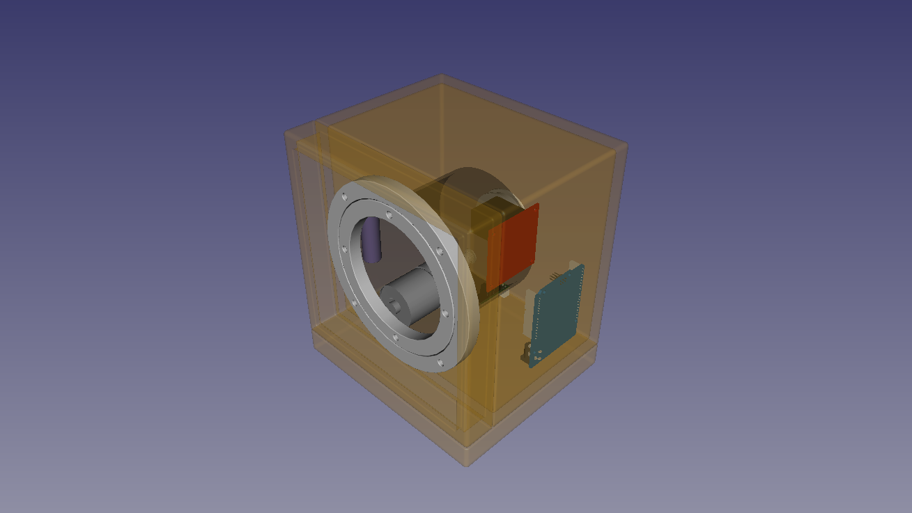
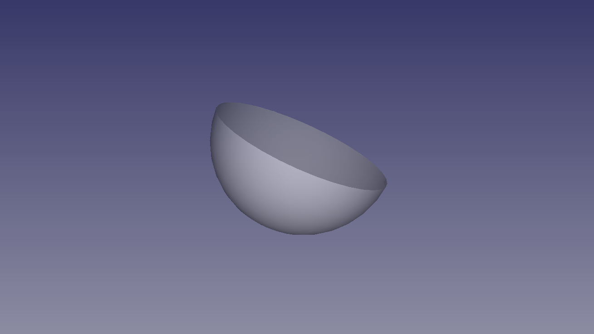
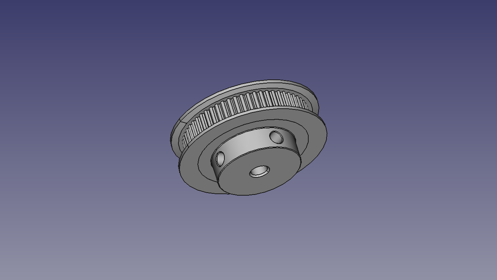
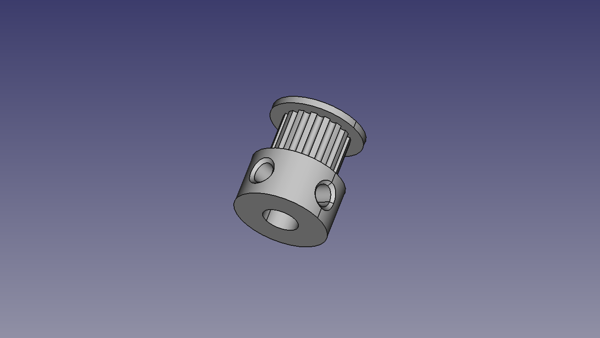
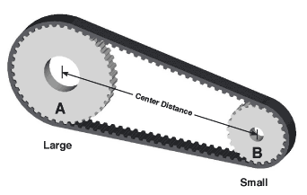
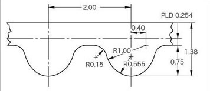
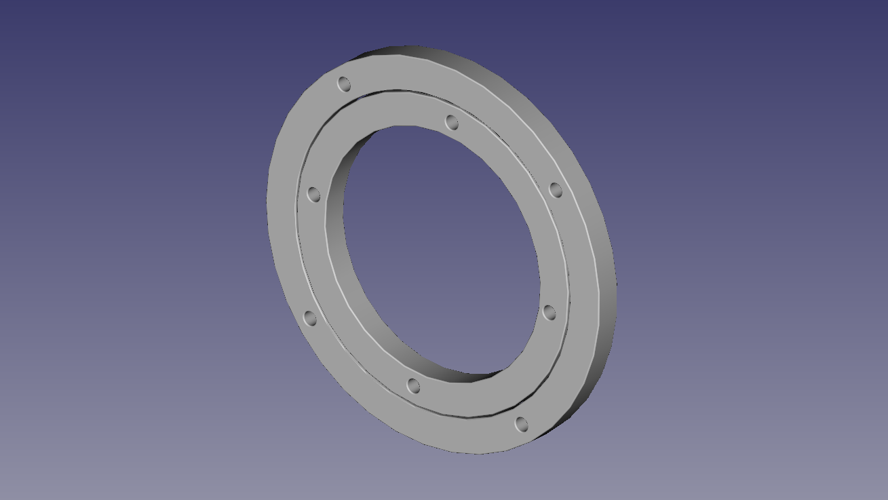
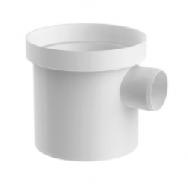

# w1 Mark I - Watch Winder

[Main page]

## Mechanics

### Case

Technical specifications:
- Material: Wood
- Feature: Noise reduction with internal fine spounge

### Base

Technical specifications:
- Material: Wood

#### Feet

Technical specifications:
- Material: Silicone
- Feature: Self adhesive
- Color: Transparent
- Diameter: 8 mm
- Height: 2.5 mm

### Engine

#### Pulleys

##### Large

Technical specifications:
- Model: GT2-60T
- Bore 5mm
- Standard: GT2
- Pinch: 2 mm
- Teeth: 60 T
- Material: Aluminium

##### Small

Technical specifications:
- Model: GT2-16T
- Bore 6mm
- Standard: GT2
- Pinch: 2 mm
- Teeth: 16T
- Material: Aluminium

#### Pulleys relationship
Calculating pulleys relantionship:

$$ s = \frac{B . 100}{A} \% $$

Where:
- A: Large pulley = 60T (Rotor Pulley)
- B: Small pulley = 16T (Motor Pulley)
- s: Speed Ratio = ?

$$ s = \frac{16 . 100}{60} \% $$

So:
$$ s = 26.7 \% $$

#### Wheelbase

Use trigonometric functions to calculate distance between points A and B.

Using the Pi constant and pulley sizes, it is possible to calculate the belt size and the number of teeth.

Wheelbase data:
- Large pulley (A): 38.2 mm
- Small pulley (B): 10.2 mm
- Center distance: **64.5 mm**
- Teeth in mesh: **6 T**

Reference: https://www.bbman.com/belt-length-calculator/

#### Belt

Technical specifications:
- Standard: GT2
- Pinch: 2 mm
- Wide: 6 mm
- Internal lenght: 208 mm
- Teeth: 104 T

#### Lazy Susan

Technical specifications:
- Material: aluminium
- Move: bearing 
- External diameter: 140 mm
- Internal diameter: 90 mm

#### Cup

Technical specifications:
- Material: PVC
- A: 100 mm
- C: 60.6 mm
- D: 101.6 mm
- DE: 94 mm
- F: 24.8 mm
- de: 37.5 mm

[Main page]

---

[Main page]: ../README.md
