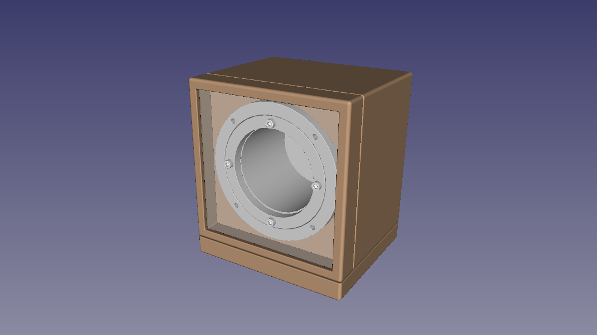

# w1 Mark I - Watch Winder

## Introduction
**w1m1** is an acronim to Watch Winder with One slot - Mark I.

A watch winder is a device used to keep automatic watch running when not worn. Automatic watches operate on the principle of winding themselves using a moving weight inside the watch. The weight swings or rotates while the watch is worn and turns the winding mechanism inside the watch. So, fairly obviously, if the watch is not worn, then it no longer receives power this way and will run down. While virtually all automatic watches can be manually wound, this is not always convenient. So the concept of an automatic watch winder was born.

A winder cannot over wind an automatic watch, since all automatic watches have a special mainspring that will never come to the end of the spring. Most winders are on some sort of a timer, so they will operate for a few minutes, then “rest” for a bit, then start their motion again.  There is no need to keep the watch in motion 24 hours.

## Videos
Watch this projects videos on [YouTube Playlist].

## Changes
All notable changes to this project will be documented in this [Change log](CHANGELOG.md).

## Mechanics
This project uses an original mech made from scratch with the following goals:
- Reliable
- Noiseless
- Robust
- Well done
- Cheap, but very beautiful

Check out [Mechanics](Mechanics/README.md) design to know more.

## Electronics
Arduino Leonardo is used with other [Electronics](Electronics/README.md) parts to control the system.

## Firmware
A fully original [Firmware](w1/README.md) was developed to this project.

## BOM - Bill of materials
If you want to build your own, take a look at [Bill of materials](BOM.md).

## Project Kanban
This project is always under enhancements. I use [Kanban](KANBAN.md) to control project evolution.

---
[YouTube Playlist]: https://www.youtube.com/watch?v=WERBobZZHRU&list=PLs1JZHyVhlZXI1KqAdF2J8b70U7dsO11w
