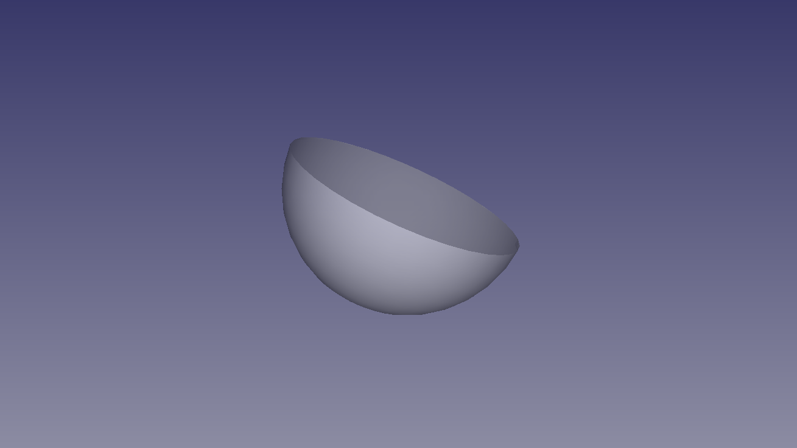
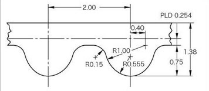
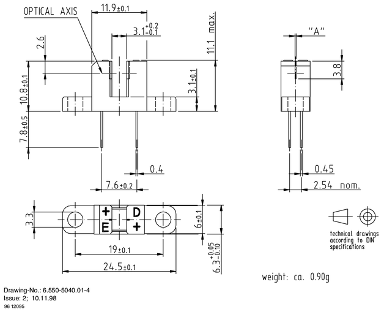

# w1 Mark I - Watch Winder

**w1m1** is an acronim to Watch Winder with One slot - Mark I.

A watch winder is a device used to keep automatic watch running when not worn. Automatic watches operate on the principle of winding themselves using a moving weight inside the watch. The weight swings or rotates while the watch is worn and turns the winding mechanism inside the watch. So, fairly obviously, if the watch is not worn, then it no longer receives power this way and will run down. While virtually all automatic watches can be manually wound, this is not always convenient. So the concept of an automatic watch winder was born.

A winder cannot over wind an automatic watch, since all automatic watches have a special mainspring that will never come to the end of the spring. Most winders are on some sort of a timer, so they will operate for a few minutes, then “rest” for a bit, then start their motion again.  There is no need to keep the watch in motion 24 hours.

[Change log](CHANGELOG.md)

[Bill of materials](BOM.md)

[Kanban](KANBAN.md)

# Mechanics


## Case


Technical specifications:
- Material: Wood
- Feature: Noise reduction with internal fine spounge

## Base


Technical specifications:
- Material: Wood

### Feet


Technical specifications:
- Material: Silicone
- Feature: Self adhesive
- Color: Transparent
- Diameter: 8 mm
- Height: 2.5 mm

## Engine

### Pulleys

#### Large


Technical specifications:
- Model: GT2-60T
- Bore 5mm
- Standard: GT2
- Pinch: 2 mm
- Teeth: 60 T
- Material: Aluminium

#### Small


Technical specifications:
- Model: GT2-16T
- Bore 6mm
- Standard: GT2
- Pinch: 2 mm
- Teeth: 16T
- Material: Aluminium

### Pulleys relationship
Calculating pulleys relantionship:

$$ s = \frac{B . 100}{A} \% $$

Where:
- A: Large pulley = 60T (Rotor Pulley)
- B: Small pulley = 16T (Motor Pulley)
- s: Speed Ratio = ?

$$ s = \frac{16 . 100}{60} \% $$

So:
$$ s = 26.7 \% $$

### Wheelbase


Use trigonometric functions to calculate distance between points A and B.

Using the Pi constant and pulley sizes, it is possible to calculate the belt size and the number of teeth.

Wheelbase data:
- Large pulley (A): 38.2 mm
- Small pulley (B): 10.2 mm
- Center distance: **64.5 mm**
- Teeth in mesh: **6 T**


Reference: https://www.bbman.com/belt-length-calculator/

### Belt


Technical specifications:
- Standard: GT2
- Pinch: 2 mm
- Wide: 6 mm
- Internal lenght: 208 mm
- Teeth: 104 T

### Lazy Susan


Technical specifications:
- Material: aluminium
- Move: bearing 
- External diameter: 140 mm
- Internal diameter: 90 mm

### Cup


Technical specifications:
- Material: PVC
- A: 100 mm
- C: 60.6 mm
- D: 101.6 mm
- DE: 94 mm
- F: 24.8 mm
- de: 37.5 mm

# Electronics

## Arduino
Technical specifications:
[Arduino Leonardo] 

### Diagram
                                 .-----.                     
    .----[PWR]-------------------| USB |--.                  
    |                            '-----'  |                  
    |                                     |                  
    |                           A5/SCL[ ] |   C5             
    |                           A4/SDA[ ] |   C4             
    |                             AREF[ ] |                  
    |                              GND[ ] |                  
    | [ ]NC                     SCK/13[ ]~|   B5             
    | [ ]v.ref                 MISO/12[ ] |   .              
    | [ ]RST                   MOSI/11[ ]~|   .              
    | [ ]3V3   +-----+              10[ ]~|   .              
    | [ ]5v    |     |               9[ ]~|   .              
    | [ ]GND   | MCU |               8[ ] |   B0             
    | [ ]GND   |     |                    |                  
    | [ ]Vin   +-----+               7[ ] |   D7             
    |                                6[ ]~|   .              
    | [ ]A0                          5[ ]~|   .              
    | [ ]A1                          4[ ] |   .              
    | [ ]A2                     INT1/3[ ]~|   .              
    | [ ]A3                     INT0/2[ ] |   .              
    | [ ]A4/SDA  RST SCK MISO     TX>1[ ] |   .              
    | [ ]A5/SCL  [ ] [ ] [ ]      RX<0[ ] |   D0             
    |            [ ] [ ] [ ]              |                  
    '--.                         .--------'                  
       \_______________________/                            

Arduino Leonardo diagram by http://busyducks.com/ascii-art-arduinos

### Pin designation
 id | pin |   type    | direction |               description                
----|-----|-----------|-----------|--------------------------------------------
  0 |   0 | digital   | input     | Serial communication
  1 |   1 | digital   | output    | Serial communication
  2 |   0 | interrupt | input     | Speed sensor
  3 |   1 | interrupt | input     | Door sensor
  4 |   - | -         | -         | -
  5 |   5 | PWM       | output    | Motor (speed control)
  6 |   6 | PWM       | output    | Motor (speed control)
  7 |   - | -         | -         | -
  8 |   - | -         | -         | -
  9 |   9 | PWM       | output    | LED R (red)
 10 |  10 | PWM       | output    | LED G (green)
 11 |  11 | PWM       | output    | LED B (blue)
 12 |   - | -         | -         | -
 13 |  13 | PWM       | output    | Status LED
 14 |   0 | analog    | input     | User distance sensor
 15 |   - | -         | -         | -
 16 |   - | -         | -         | -
 17 |   - | -         | -         | -
 18 |   - | -         | -         | -
 19 |   5 | analog    | input     | Random number generator Seed
 
## Motor


Technical specifications:
- Model: ZGB37RG
- Shaft speed: 100 RPM
- Rotor Speed: 5000r/min
- Reversibility: yes
- Voltage: 12V DC
- Current: 800mA (no load)
- Torque: 4kg/cm
- Diameter: 37mm
- Shaft length: 15mm
- Shaft diameter: 6mm

### Driver


> "The L298 is an integrated monolithic circuit in a 15-lead Multiwatt and Power SO20 packages. It is a high voltage, high current dual full-bridge driver designed to accept standard TTL logic levels and drive inductive loads such as relays, solenoids, DC and stepping motors. Two enable inputs are provided to enable or disable the device independently of the input signals. The emitters of the lower transistors of each bridge are connected together and the corresponding external terminal can be used for the connection of an external sensing resistor. Anadditional supply input is provided so that the logic works at a lower voltage."
>
> -- From: [L298](Documents/L298.pdf) data book

L298N absolute maximum ratings:

 Symbol   | Parameter                              | Value      | Unit
----------|----------------------------------------|------------|--------------
 Vs       | Power Supply                           |         50 | V
 Vss      | Logic Supply Voltage                   |          7 | V
 Vi,Ven   | Input and Enable Voltage               |  -0.3 to 7 | V
 Io       | Peak Output Current (each Channel)     |          2 | A
 Vsens    | Sensing Voltage                        |  -1 to 2.3 | V
 Ptot     | Total Power Dissipation (Tcase = 75°C) |         25 | W
 Top      | Junction Operating Temperature         | -25 to 130 | °C
 Tstg, Tj | Storage and Junction Temperature       | -40 to 150 | °C

### Speed sensor


> "The TCST2103 is a transmissive sensor that include an infrared emitter and phototransistor, located face-to-face on the optical axes in a leaded package which blocks visible light."
>
> -- From: [TCST2103](Documents/TCST2103.pdf) data book

## Charger system

### Qi

## Door sensor
Technical specifications:
- Model: Sensor 44E_938
- Type: Magnetic

# Software

## G-Code

<!---------------------------------------------------------------------------->

### G28 - Gracefully stop

#### Usage

```
G28
```

 Argument    | Description                                                      
-------------|---------------------------------
 none        | no arguments supported                                           

#### Notes

Go to home position and gracefully stop.

#### Example

~~~ gcode
G28
~~~

<!---------------------------------------------------------------------------->

### M0 - Unconditional stop

#### Usage

```
M0
```

 Argument    | Description
-------------|---------------------------------
 none        | no arguments supported

#### Notes

#### Example

~~~ gcode
M0
~~~

<!---------------------------------------------------------------------------->

### M1 - Clockwise

#### Usage

```
M1 [S<rate>]
```

 Argument     | Description
--------------|---------------------------------
 `[S<rate>]`  | Speed rate [0,100]
 `[A<value>]` | Absolute speed (RPD - Revolutions Per Day) [X,XXX]

#### Notes
Speed limits:
- Minimum speed:  RPM
- Maximum speed:  RPM

#### Examples

Set direction to Clockwise:
~~~ gcode
M1
~~~

Set direction to Clockwise at 80% speed rate:
~~~ gcode
M1 S80
~~~

Set direction to Clockwise at 600 RPD:
~~~ gcode
M1 A600
~~~

<!---------------------------------------------------------------------------->

### M2 - Counterclockwise

#### Usage

```
M2 [S<rate>]
```

 Argument     | Description
--------------|---------------------------------
 `[S<rate>]`  | Speed rate [0,100]
 `[A<value>]` | Absolute speed (RPD - Revolutions Per Day) [X,XXX]

#### Notes
Speed limits:
- Minimum speed:  RPM
- Maximum speed:  RPM

#### Examples

Set direction to Counterclockwise, using current speed:
~~~ gcode
M2
~~~

Set direction to Counterclockwise at 70% speed rate:
~~~ gcode
M2 S70
~~~

<!---------------------------------------------------------------------------->

### M3 - Show motor direction and speed

#### Usage

```
M3
```

 Argument     | Description
--------------|---------------------------------
 none         | no arguments supported

#### Notes

#### Examples

Get direction and current speed:
~~~ gcode
M3
~~~

<!---------------------------------------------------------------------------->

### M15 - System information

#### Usage

```
M15
```

 Argument     | Description
--------------|---------------------------------
 none         | no arguments supported

#### Notes

#### Examples

Get system information:
~~~ gcode
M15
~~~

<!---------------------------------------------------------------------------->

### M89 - Memory information

#### Usage

```
M89
```

 Argument     | Description
--------------|---------------------------------
 none         | no arguments supported

#### Notes

#### Examples

Get memory information:
~~~ gcode
M89
~~~

<!---------------------------------------------------------------------------->

### M92 - System version

#### Usage

```
M92
```

 Argument     | Description
--------------|---------------------------------
 none         | no arguments supported

#### Notes

#### Examples

Get system version:
~~~ gcode
M92
~~~

<!---------------------------------------------------------------------------->

### M99 - Reset

#### Usage

```
M99
```

 Argument     | Description
--------------|---------------------------------
 none         | no arguments supported

#### Notes

#### Examples

Reset device:
~~~ gcode
M99
~~~

<!---------------------------------------------------------------------------->

### M100 - Help message

#### Usage

```
M100
```

 Argument     | Description
--------------|---------------------------------
 none         | no arguments supported

#### Notes

#### Examples

Show help message:
~~~ gcode
M100
~~~

<!---------------------------------------------------------------------------->

### M111 - Debug mode

#### Usage

```
M111
```

 Argument     | Description
--------------|---------------------------------
 none         | no arguments supported

#### Notes

#### Examples

Enable Debug mode:
~~~ gcode
M111
~~~

Disable Debug mode:
~~~ gcode
M111
~~~

---

[Arduino Leonardo]: https://www.arduino.cc/en/Main/arduinoBoardLeonardo/#techspecs
